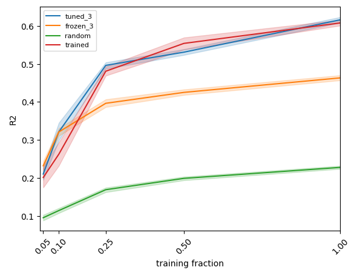

# Self-supervised learning for genotype-phenotype mappings

A genotype-phenotype mapping associates genotypes with phenotypes, e.g., HIV genotypes with their resistance to a certain drug.
In this project we pretrain a neural network on the genotypes and thereby achieve better genotype-phenotype regression performance
in the low data regime.

The following plot summarizes our results.



* random: we use a randomly initiallized fully connected neural network to extract features for a linear regression model,
* frozen_3: we use a pretrained neural network to extract features for a linear regression model,
* trained: we train a neural network to solve the regression task,
* tuned_3: we finetune the pretrained neural network on the regression task.

In order to compute confidence intervals, we repeated experiment 10 times.

## How to run   
First, install dependencies   
```bash
# clone project   
git clone git@gitlab.inf.ethz.ch:PRV-PUESCHEL/wendlerc/ssl_genopheno.git

# install project   
cd csss
conda create -n ssl_genopheno python=3.9
conda activate ssl_genopheno
pip install -r requirements.txt
conda install jupyter
```   
 Next, pretrain a neural network with either   
 ```bash
python genotype/pretrain.py --wandb_name pretrained 
```
or
 ```bash
python genotype/pretrain_vicreg.py --wandb_name pretrained_vicreg
```

Finetune the resulting model either using
 ```bash
python genotype/regression.py --wandb_pretrained pretrained
```
or
 ```bash
python project/cfo/regression_vicreg.py --wandb_pretrained pretrained_vicreg
```

Evaluate using a frozen pretrained model using
 ```bash
python project/cfo/regression_sklearn.py --wandb_pretrained pretrained
```

